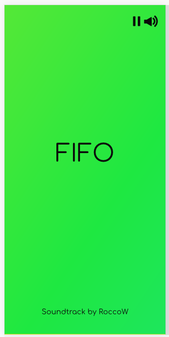

# FIFO by Chris Tsoi
Welcome to the wonderful world of FIFO. FIFO is a 2-player stack removal game created during my training as a Web Developer at Sparta Global.

## Basics

### Aim
The aim of the game is to play against an opponent, to see who can remove the most blocks in the time limit. There are multiple types(colour) blocks and the player must chose the correct key relating to the correct block on the bottom row.

### Controls
Each player simply has a set of four keys that are assigned to each colour block. By pressing these keys when the lowest block is the same color, the block will be removed and the player will receive a single point.

__Beware though as clicking wrong will remove a point!__

## Settings
There are a variety of settings to tailor your experience including:
* Number of Stacks: Can either choose from a single or double stacks
* Similarity: Both players can either have the exact same stacks or have unique ones
* Power-Ups: Power up your day with some unique power-ups that can move you ahead

Just choose what you wish from the menu area.

## About
This game was created over a few days as a small web project at my time during Sparta Global. It had a few requirements/restrictions including:
* Being 2-player (Player vs Player) or (Player vs Computer)
* Built with HTML, CSS/SCSS, JS(Jquery)
* Basic frameworks are Welcome
* No canvas or 3D
* Got to be fun!

## Credits
For this project I used a few resources from elsewhere and I would like to duly credit them.

#### Soundtrack
Artist: RoccoW - Album: ロッコ Track: 07 (CC BY-SA 4.0)
 http://freemusicarchive.org/music/RoccoW/_1035/RoccoW_-__-_07_Fuck_Sidechain_Compression_on_Gameboy

#### A variety of sound effects from soundbible.com
Recorded by Mark DiAngelo @ http://soundbible.com/2067-Blop.html

Recorded by Mike Koenig @ http://soundbible.com/994-Mirror-Shattering.html

Recorded by KP @ http://soundbible.com/1639-Power-Up.html

#### Extra
Thank you to stackoverflow, my tutor Ollie Holden and my fellow teammates for all their help

***

## Game Creation

### Idea
The idea mainly came about from the slight restrictions on creation. I thought some time about games that could work using html elements, but in a way where it would make sense to do it that way.

This resulted in the thought of div blocks dropping down and the player/s having to select the correct one in order to get points.

A quick sketch and a few logic questions later I had a game.

### Wireframes

Initial Wireframes before creation of the game. A mobile first approach was done in creating the site.

### Creation
My approach was to get the menu and basic game layout created before moving onto the actual javascript.

I took a step by step approach doing each piece of simple logic at a time. Originally starting in es5 with functions being created, I was given the challenge of converting it to es6 and OOP based.

### Game in play
This section shows each game 'layer' in a variety of screen resolutions to show the responsiveness.

### Conclusions
The final result is a neat little game I am proud of creating. I've learned an incredible amount with regards to javascript/jquery as well as brining OOP to my web projects, and look forward to continuing that.
